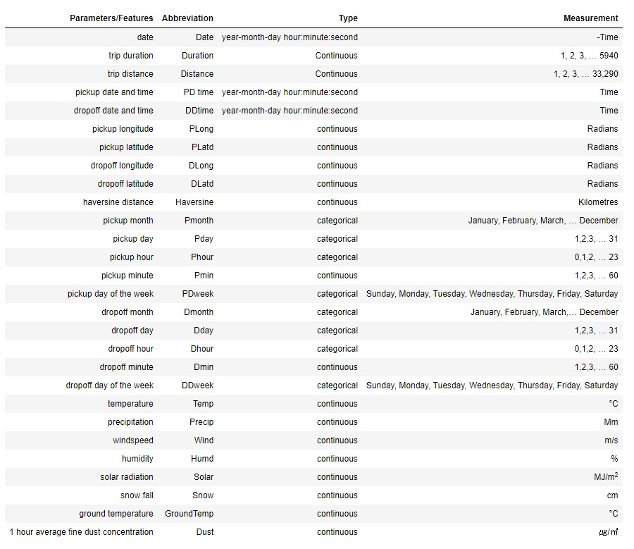

# Seoul-Bike-Trip-Duration-Prediction

Description - Trip duration is the most fundamental measure in all modes of transportation.
Hence, it is crucial to predict the trip-time precisely for the advancement of Intelligent
Transport Systems (ITS) and traveller information systems. In order to predict the trip
duration, data mining techniques are employed in this paper to predict the trip duration of
rental bikes in Seoul Bike sharing system. The prediction is carried out with the combination
of Seoul Bike data and weather data. The Data used include trip duration, trip distance,
pickup-drop-off latitude and longitude, temperature, precipitation, wind speed, humidity, solar
radiation, snowfall, ground temperature and 1-hour average dust concentration.

## Dataset Details

## Dataset:- Download from [**here**](https://www.kaggle.com/saurabhshahane/seoul-bike-trip-duration-prediction).
## Deployment Link: - https://seoulbiketripdurationpred.herokuapp.com/.
## Video Link: - [**here**](https://drive.google.com/file/d/1VO3ENntYdhsSVLJGHCLpAefoa0J8r9PV/view?usp=sharing)
